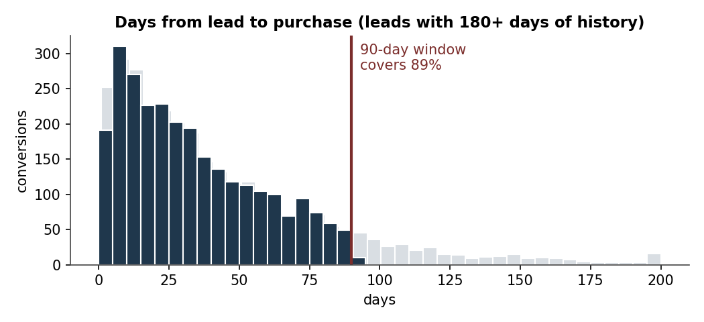
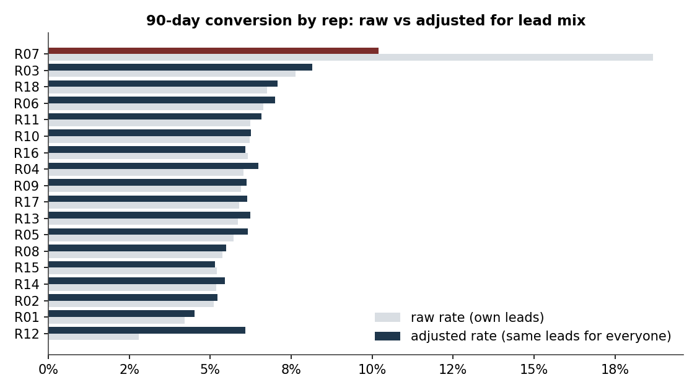
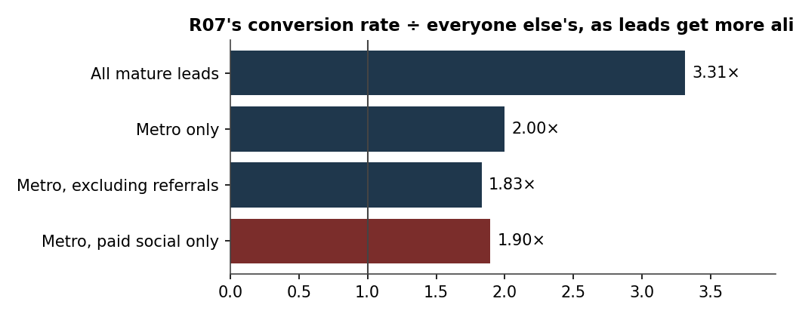
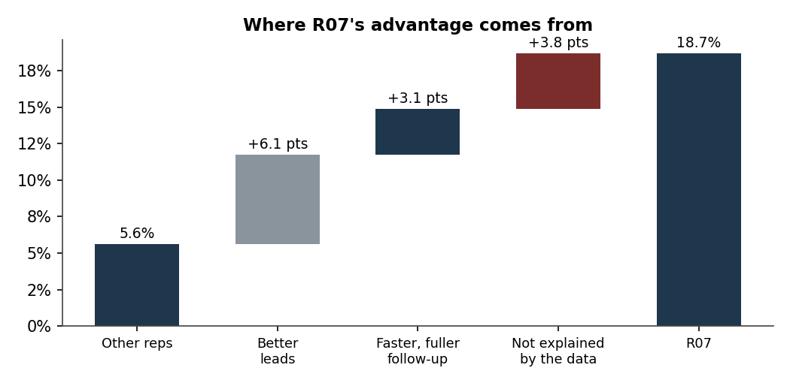
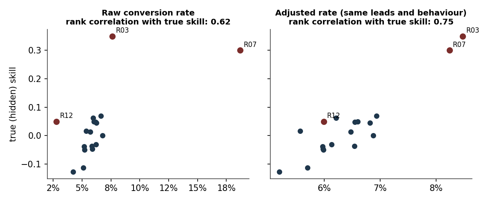

# Is the top sales rep better, or just better supplied?

A decision report on sales-rep performance. It separates **what a rep is
given** (lead quality) from **what a rep does** (first-week follow-up), and
turns the result into an operating recommendation and a pilot plan.

> **The data is simulated** (`src/simulate.py`, fixed seed). That is a
> feature: because the hidden rep skill that generated the data is known, the
> last section checks whether the method actually finds it.

## The question

An inside-sales team of 18 reps handles ~60k inbound leads a year. One rep,
**R07**, converts **18.7%** of leads to a paid plan within 90 days. Everyone
else averages **5.6%**. Management's instinct: *"have everyone work like R07."*

Is that the right conclusion?

## Answer in one screen

| | |
|---|---|
| **R07's lead is real, but mostly not skill.** | 3.3× the others on raw numbers. Compare like-for-like leads and the gap falls to about 1.9×. |
| **Half the gap is lead mix.** | 92% of R07's leads are metro (others 43%), and R07 gets twice the share of referrals. Metro leads convert 4.5× better than regional; referrals 7× better than paid social. |
| **Speed of first contact is the transferable part.** | Leads contacted within an hour convert at 14.6%; leads never contacted, 1.5%. |
| **Recommendation** | Don't copy R07. Copy R07's **speed**: first contact within 1 hour, no lead left untouched in week one. Projected lift: **6.7% → 8.9%** conversion. |
| **Before rolling out** | Pilot with **~2,300 leads per arm** (80% power, α = 0.05). |

## 1 · Why a 90-day window



Among leads old enough to have 180 days of history, the median lead buys after
31 days, and 89% of purchases happen within 90 days (P80 = 70 days). Ninety
days captures nearly all conversions while leaving enough mature leads to
compare reps. Leads younger than 90 days are excluded from the outcome, so
recent months and new reps are not penalised for time that has not passed yet.

## 2 · Raw ranking vs a fair comparison



Grey bars are raw rates on each rep's own leads. Navy bars ask: *what would
each rep convert if everyone had the same leads?* (logistic regression on
region, channel and lead score, then every rep scored on the full lead pool).
R07 drops from 18.7% to 10.2%, still first. **R12**, last on the raw ranking
at 2.8%, rises to 13th at 6.1%, level with most of the team. R12 simply gets
89% regional leads.

## 3 · Sensitivity: make the leads more alike, watch the gap shrink



| Comparison | R07 rate | Others' rate | Ratio |
|---|---|---|---|
| All mature leads | 18.7% | 5.6% | **3.31×** |
| Metro only | 19.8% | 9.9% | 2.00× |
| Metro, excluding referrals | 13.0% | 7.1% | 1.83× |
| Metro, paid social only | 10.7% | 5.7% | **1.90×** |

The ratio stops falling at roughly 1.9×. Something beyond lead mix is there.

## 4 · Where R07's advantage comes from



Starting from the other reps' 5.6%:

- **+6.1 pts** from better leads (R07's leads, scored with typical behaviour and a typical rep)
- **+3.1 pts** from faster, fuller follow-up (R07's contact speed and attempts)
- **+3.8 pts** not explained by anything in the CRM: call quality, qualification, objection handling

The first part is a routing decision, not a rep quality. The last part is real
but can't be copied from a dashboard. **Only the middle part is transferable
through process.**

## 5 · Is the model any good?

Trained on leads before Dec 2024, tested on the later 25%:

| Model | ROC-AUC | PR-AUC |
|---|---|---|
| Lead mix only | 0.814 | 0.300 |
| Lead mix + first-week behaviour | **0.828** | **0.317** |

Predicted and observed conversion agree by decile (see `reports/results.json`).
The behaviour effects it recovers (e.g. +0.49 log-odds for contact within an
hour) match the values used to simulate the data.

## 6 · What if the whole team worked faster?

Scored with the full model on all mature leads:

| Scenario | Conversion | vs today |
|---|---|---|
| Today | 6.7% | |
| Every contacted lead reached within 1 hour | 8.1% | +21% |
| No lead abandoned in week one | 7.3% | +9% |
| Both | **8.9%** | **+33%** |

These are model projections, not promises. Routing and hidden skill stay as
they are. Hence the pilot: randomise new leads between the current process and
a "1-hour first contact + no abandonment" rule, ~2,300 leads per arm, for one
90-day cycle.

## 7 · Did the method find the truth?



Each rep's hidden skill is stored in `data/ground_truth_reps.csv` and read
only here.

- The **raw** ranking names R07 the best rep. The **adjusted** ranking names
  **R03**. R03 has the highest true skill, with ordinary leads and ordinary
  speed.
- Rank correlation with true skill improves from **0.62 (raw)** to
  **0.75 (adjusted)**.
- R12 moves from **18th → 12th**. Most of R12's "poor performance" was routing.

On real data there is no answer key. This is why it's worth testing the method
where there is one.

## Run it

```bash
pip install -r requirements.txt
python src/simulate.py    # writes data/leads.csv (+ ground truth)
python src/analyze.py     # writes reports/results.json and reports/figures/
```

## Files

```
src/simulate.py        lead-level simulation with a known ground truth
src/analyze.py         the full analysis; every number above comes from here
reports/results.json   all results, machine-readable
reports/figures/       charts used in this README
```

---

**Zahra Kazemi**, analytics engineer ·
[LinkedIn](https://www.linkedin.com/in/zahra-kazemi-1b9149147/) ·
[dbt project](https://github.com/Zahra2105/olist-analytics-dbt)
